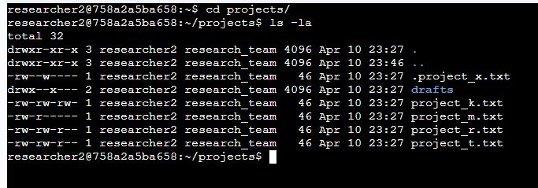
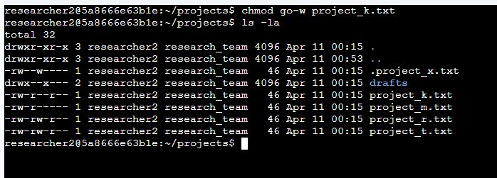
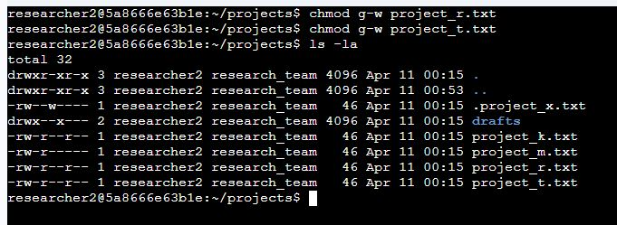
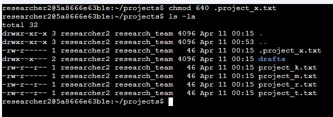
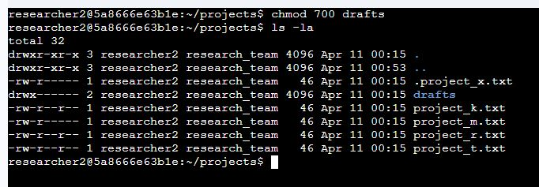

# Linux File System Security Assessment and Access Control Hardening

## Incident / Assessment Overview

This project presents a Linux-based file system security assessment conducted in a simulated enterprise environment supporting a research team. The objective of this assessment was to validate that file and directory permissions were correctly configured to enforce authorized access and to prevent unauthorized modification, exposure, or misuse of sensitive research data.

As part of routine security operations, the organization required a formal review of its file system access controls to ensure compliance with internal security policies and best practices. Misconfigured permissions can introduce significant risks, including unauthorized data modification, insider threats, and privilege escalation. Therefore, a systematic evaluation of access controls was necessary to maintain the confidentiality and integrity of research data.

In this scenario, I acted as a security professional responsible for access control enforcement within the `/home/researcher2/projects` directory. My objective was to review existing permissions, identify misconfigurations or excessive privileges, and implement corrective actions to align with the organization’s access control policy and the principle of least privilege.

### Security Policy Requirements

The organization enforces a strict file system access control policy to ensure that permissions are appropriately assigned and do not expose sensitive data to unauthorized users. The key requirements include:

- Write permissions must not be assigned to “others” under any circumstances  
- Group permissions must be restricted to read-only access unless explicitly required  
- Hidden files must be treated as sensitive and must not allow unauthorized modification  
- Directory access must be limited to authorized users, with execute permissions carefully controlled  
- All permissions must follow the principle of least privilege and be regularly reviewed for compliance  

**My role:** I analyzed file system permissions, interpreted Linux permission structures, identified security gaps, and applied corrective controls using Linux command-line tools such as `ls -la` and `chmod`. This process ensured that all access controls were properly enforced and aligned with the organization’s security policy.

---

## Technical Approach & Tools Used

To begin the assessment, I performed a detailed review of file and directory permissions using:

```bash
ls -la
```

This command allowed me to:
- Display all files, including hidden files (`.` prefix)  
- View detailed permission structures  
- Identify ownership (user and group)  
- Detect potential misconfigurations and excessive permissions  



**Screenshot Placeholder**  

---

## Key Findings & Impact

### Permission Misconfigurations Identified

#### File-Level Issues

- **project_k.txt (`-rw-rw-rw-`)**  
  Write access is granted to both group and others, making the file globally writable.  
  This directly violates the organization’s policy, which strictly prohibits write permissions for “others.”  
  As a result, any user on the system can modify the file, creating a high-risk exposure.

- **project_r.txt and project_t.txt (`-rw-rw-r--`)**  
  Group write access is enabled without a clearly defined business requirement.  
  While less critical than global write access, this configuration exceeds least privilege requirements and allows unauthorized modification by group members.

- **.project_x.txt (hidden file) (`-rw--w----`)**  
  The file is misconfigured with group write-only access, which violates the policy for hidden file protection.  
  Hidden files must not allow modification by group or others.  
  This configuration is particularly risky because it allows changes to be made without visibility, increasing the likelihood of unnoticed tampering.

---

#### Directory-Level Issues

- **drafts/ (`drwx--x---`)**  
  The directory grants execute (`x`) permission to the group, allowing users to traverse and access its contents.  
  This violates the requirement that sensitive directories must be restricted to authorized users only (in this case, the owner `researcher2`).  
  Directory execute permissions can expose file structure and enable unintended access.

---

### Security Impact

These misconfigurations introduce several security risks and policy violations:

- **Unauthorized data modification:**  
  Globally writable and group-writable files allow unauthorized users to alter sensitive research data.

- **Insider threat exposure:**  
  Excessive group permissions increase the likelihood of misuse or accidental modification by internal users.

- **Privilege escalation opportunities:**  
  Writable files can be leveraged by attackers to manipulate data or execute malicious actions.

- **Hidden data exposure and tampering:**  
  Improperly secured hidden files can be modified without detection, increasing the risk of stealth attacks.

- **Unauthorized directory access:**  
  Execute permissions on directories enable traversal, potentially exposing sensitive file names and contents.

- **Non-compliance with access control policy:**  
  The identified issues demonstrate inconsistent enforcement of least privilege and organizational security standards.
---
## Permission Analysis Methodology

I analyzed permissions using the standard 10-character Linux permission string.

### Example

```bash
-rw-rw-r--
```

### Breakdown

- 1st character → File type (`-` = file, `d` = directory)  
- Next 3 → User (owner) permissions  
- Next 3 → Group permissions  
- Last 3 → Others permissions  

### Interpretation

- User: read + write  
- Group: read + write  
- Others: read only  

This structure enabled me to identify:
- Excessive write permissions  
- Unauthorized access exposure  
- Violations of least privilege principles  

---
## Remediation Actions Performed

Based on the identified policy violations and permission misconfigurations, I implemented targeted remediation actions to enforce least privilege, eliminate unauthorized access, and restore compliance with the organization’s file system security policy.

---

### 1. Securing Globally Writable File (project_k.txt)

To address the critical issue of global write access, I removed unauthorized write permissions assigned to both group and others:

```bash
chmod go-w project_k.txt
```

### Explanation
- `g` refers to group  
- `o` refers to others  
- `-w` removes write permission  

### Outcome
- Eliminated global write access (`-rw-rw-rw-` → `-rw-r--r--`)  
- Ensured that only the file owner retains write privileges  
- Brought the file into compliance with the policy prohibiting write access for “others”  

This remediation significantly reduced the risk of unauthorized modification and data tampering.



---

### 2. Restricting Excessive Group Write Permissions (project_r.txt, project_t.txt)

To enforce least privilege and reduce insider risk, I removed unnecessary group write access:

```bash
chmod g-w project_r.txt
chmod g-w project_t.txt
```

### Explanation
- `g` refers to group  
- `-w` removes write permission  

### Outcome
- Updated permissions from `-rw-rw-r--` to `-rw-r--r--`  
- Limited modification rights to the file owner only  
- Reduced exposure to unauthorized changes by group members  

This action aligns with the policy requirement that group access should be restricted unless explicitly justified.



---

### 3. Securing Hidden File Permissions (.project_x.txt)

The hidden file was improperly configured with group write access, which violates hidden file protection requirements.

```bash
chmod 640 .project_x.txt
```

### Explanation
Linux uses a numeric (octal) permission system where each digit represents a set of permissions assigned to the user, group, and others.

#### Permission Values
- 4 = read (r)
- 2 = write (w)
- 1 = execute (x)

Permissions are calculated by adding these values together. 
- `6` → user (read + write)  
- `4` → group (read only)  
- `0` → others (no access)  
### Outcome
- Removed unauthorized group write access  
- Ensured controlled read-only access for authorized group members  
- Fully restricted access for others  
- Secured sensitive hidden data against unauthorized or unnoticed modification  

This remediation ensures compliance with policy requirements for protecting hidden and archived files.



---

### 4. Restricting Directory Access (drafts/)

To eliminate unauthorized directory traversal and enforce strict access control:

```bash
chmod 700 drafts
```

### Explanation
- `7` → user (read, write, execute)  
- `0` → group (no access)  
- `0` → others (no access)  

### Outcome
- Removed group execute permission (`drwx--x---` → `drwx------`)  
- Prevented unauthorized users from traversing or accessing directory contents  
- Ensured that only the owner (`researcher2`) can access the directory  

This action aligns with the policy requirement that sensitive directories must be restricted to authorized users only.



---

## Remediation Summary

The implemented changes successfully addressed all identified policy violations by:

- Eliminating global and group-based write access where not required  
- Securing hidden files against unauthorized modification  
- Restricting directory access to authorized users only  
- Enforcing least privilege across all files and directories  

These actions significantly improved the overall security posture of the system and ensured compliance with the organization’s access control policy.


---

## Additional Security Considerations

During this project, I reinforced the following security concepts:

- Awareness of hidden files (`.` prefix)  
- Importance of execute permission on directories  
- Enforcement of least privilege principle  
- Use of numeric vs symbolic `chmod` modes  
- Clear distinction between user, group, and others access levels  

---
### Verification & Validation

After applying remediation actions, I validated that all permissions were correctly enforced using:

```bash
ls -la
```

I confirmed:
- No files had write permissions for "others"
- Group permissions were limited to read-only where appropriate
- Hidden files followed strict access control rules
- Sensitive directories were restricted to the owner only

This step ensured that remediation actions were effective and aligned with policy requirements.

---

### Before vs After Summary

| Item | Before | After | Risk Reduction |
|------|--------|-------|--------------|
| project_k.txt | -rw-rw-rw- | -rw-r--r-- | Eliminated global write access |
| project_r.txt / project_t.txt | -rw-rw-r-- | -rw-r--r-- | Removed unnecessary group write |
| .project_x.txt | -rw--w---- | -rw-r----- | Secured hidden file access |
| drafts/ | drwx--x--- | drwx------ | Restricted directory traversal |

---

### Key Security Principles Applied

- Principle of Least Privilege (PoLP)
- Access Control Enforcement
- Data Integrity Protection
- Insider Threat Mitigation
- Secure Configuration Management

---

## Summary

This project demonstrates a full security workflow:

1. Identify misconfigurations
2. Analyze risks based on policy
3. Apply targeted remediation
4. Validate and verify corrections

This project demonstrates my ability to apply Linux security best practices, enforce access control policies, and protect sensitive data through proper permission management.
By enforcing strict access controls and aligning configurations with security policies, I significantly improved the system’s security posture and reduced the risk of unauthorized access and data compromise.


