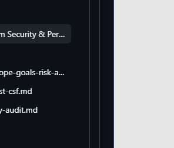

# Linux File System Security Assessment and Access Control Hardening

## Incident / Assessment Overview

This project presents a Linux-based file system security assessment conducted in a simulated enterprise environment supporting a research team. The objective of this assessment was to validate that file and directory permissions were correctly configured to enforce authorized access and to prevent unauthorized modification, exposure, or misuse of sensitive research data.

As part of routine security operations, the organization required a formal review of its file system access controls to ensure compliance with internal security policies and best practices. Misconfigured permissions can introduce significant risks, including unauthorized data modification, insider threats, and privilege escalation. Therefore, a systematic evaluation of access controls was necessary to maintain the confidentiality and integrity of research data.

In this scenario, I acted as a security professional responsible for access control enforcement within the `/home/researcher2/projects` directory. My objective was to review existing permissions, identify misconfigurations or excessive privileges, and implement corrective actions to align with the organization’s access control policy and the principle of least privilege.

### Security Policy Requirements

The organization enforces a strict file system access control policy to ensure that permissions are appropriately assigned and do not expose sensitive data to unauthorized users. The key requirements include:

- Write permissions must not be assigned to “others” under any circumstances  
- Group permissions must be restricted to read-only access unless explicitly required  
- Hidden files must be treated as sensitive and must not allow unauthorized modification  
- Directory access must be limited to authorized users, with execute permissions carefully controlled  
- All permissions must follow the principle of least privilege and be regularly reviewed for compliance  

**My role:** I analyzed file system permissions, interpreted Linux permission structures, identified security gaps, and applied corrective controls using Linux command-line tools such as `ls -la` and `chmod`. This process ensured that all access controls were properly enforced and aligned with the organization’s security policy.

---

## Technical Approach & Tools Used

To begin the assessment, I performed a detailed review of file and directory permissions using:

```bash
ls -la
```

This command allowed me to:
- Display all files, including hidden files (`.` prefix)  
- View detailed permission structures  
- Identify ownership (user and group)  
- Detect potential misconfigurations and excessive permissions  



**Screenshot Placeholder**  

---

## Permission Analysis Methodology

I analyzed permissions using the standard 10-character Linux permission string.

### Example

```bash
-rw-rw-r--
```

### Breakdown

- 1st character → File type (`-` = file, `d` = directory)  
- Next 3 → User (owner) permissions  
- Next 3 → Group permissions  
- Last 3 → Others permissions  

### Interpretation

- User: read + write  
- Group: read + write  
- Others: read only  

This structure enabled me to identify:
- Excessive write permissions  
- Unauthorized access exposure  
- Violations of least privilege principles  

---

## Environment Overview

**Files analyzed:**
- project_k.txt  
- project_m.txt  
- project_r.txt  
- project_t.txt  
- .project_x.txt (hidden file)  

**Directory:**
- drafts/  

---

## Key Findings & Impact

### Permission Misconfigurations Identified

#### File-Level Issues
- **project_k.txt**  
  Write access granted to group and others, allowing unauthorized modification  

- **project_r.txt and project_t.txt**  
  Unnecessary group write access, increasing risk of unintended or malicious changes  

- **.project_x.txt (hidden file)**  
  Incorrect permissions where the group had write access instead of read-only access  

#### Directory-Level Issues
- **drafts/**  
  Group had execute access, allowing unintended access to directory contents  

---

### Security Impact

These misconfigurations introduced several risks:

- Unauthorized modification of sensitive research data  
- Increased exposure to insider threats  
- Potential privilege escalation through writable files  
- Exposure of hidden or archived data  
- Violation of least privilege and access control policies  

---

## Remediation Actions Performed

### 1. Securing Over-Permissive Files

To enforce least privilege, I removed unauthorized write access using:

```bash
chmod go-w project_k.txt
```

### Explanation
- `g` refers to group  
- `o` refers to others  
- `-w` removes write permission  

This command removed write permissions from group and others and ensured that only the file owner can modify the file.

**Screenshot Placeholder**  
`screenshots/chmod-project_k.png`

---

### 2. Securing Hidden File Permissions

Hidden files are often overlooked but can contain sensitive or archived data and must be properly secured.

**File:**
```
.project_x.txt
```

**Required Permissions:**
- User: read + write  
- Group: read only  
- Others: no access  

**Command Used:**

```bash
chmod 640 .project_x.txt
```

### Explanation
- `6` → user (read + write)  
- `4` → group (read only)  
- `0` → others (no access)  

This change:
- Prevents unauthorized modification  
- Maintains controlled access for the group  
- Protects sensitive archived data  

**Screenshot Placeholder**  
`screenshots/hidden-file.png`

---

### 3. Restricting Directory Access

The `drafts` directory must only be accessible by `researcher2`.

**Current Issue:**  
Group had execute access, allowing unauthorized users to access directory contents.

**Command Used:**

```bash
chmod 700 drafts
```

### Explanation
- `7` → user (read, write, execute)  
- `0` → group (no access)  
- `0` → others (no access)  

This ensures:
- Only the owner can access the directory  
- No unauthorized browsing or execution is possible  

**Screenshot Placeholder**  
`screenshots/chmod-directory.png`

---

## Additional Security Considerations

During this project, I reinforced the following security concepts:

- Awareness of hidden files (`.` prefix)  
- Importance of execute permission on directories  
- Enforcement of least privilege principle  
- Use of numeric vs symbolic `chmod` modes  
- Clear distinction between user, group, and others access levels  

---

## Summary

In this project, I analyzed and secured a Linux file system by identifying permission misconfigurations and enforcing appropriate access controls. Using tools such as `ls -la` and `chmod`, I removed excessive privileges, corrected hidden file permissions, and restricted directory access to authorized users only.

This project demonstrates my ability to apply Linux security best practices, enforce access control policies, and protect sensitive data through proper permission management—skills that are essential for SOC Analyst, Security Analyst, and system hardening roles.

